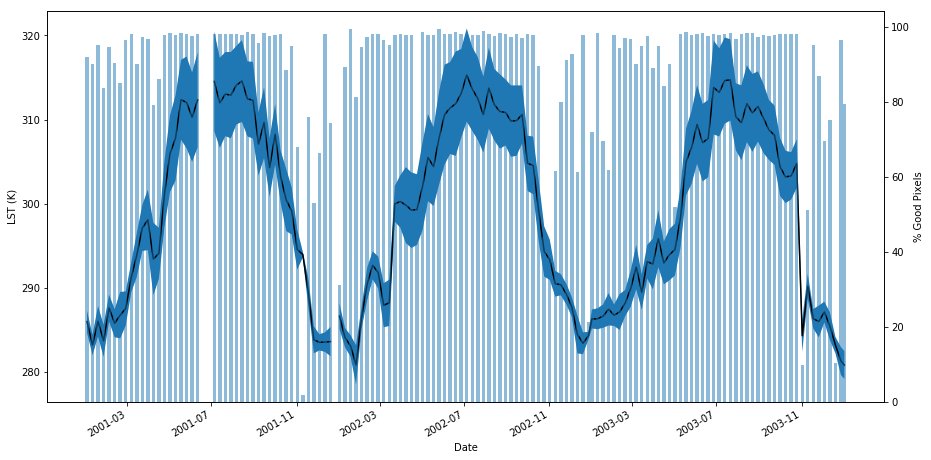

# Access the MODIS web service and perform quality filtering using R

*Author: ORNL DAAC*  
*Date: May 15, 2018*  
*Contact for ORNL DAAC: uso@daac.ornl.gov*  

### Keywords: MODIS, web service, R, REST

## Overview

The tutorial outlined in the [jupyter notebook](modis_restservice_qc_filter_Python.ipynb) will explore using the Python to access MODIS Land Products through the new (May 2018) REST-based web service hosted by the ORNL DAAC. For a full description and usage examples of the web service, please visit the ORNL DAAC's MODIS microsite: https://modis.ornl.gov/data/modis_webservice.html

Using the MODIS Web Service users can:

* Retrieve MODIS subsets through command line operations
* Download and integrate subsets directly into client-side workflows
* Download and visualize subsets with customized code 
... and much more.

This tutorial will demonstrate how to do the following in Python:

* **dates** and **subset** request examples
* build a time series of MOD11A2 land surface temperature from multiple web service subset requests
* perform quality control filtering based on multiple MODIS qc criteria

[The same tutorial is provided in R in another ORNL DAAC repository.](https://github.com/ornldaac/modis_restservice_qc_filter_R)

## Source Data

Input data were accessed through the [MODIS Web Service](https://modis.ornl.gov/data/modis_webservice.html) hosted at the ORNL DAAC. All necessary steps for accessing the web service using Python are outlined in the [jupyter notebook](modis_restservice_qc_filter_Python.ipynb).

Other methods for accessing data through the web service are described at the MODIS web page; https://modis.ornl.gov. 

## Prerequisites: 

Python 2 or 3 Libraries: requests, json, datetime, pandas, numpy, matplotlib

## Procedure

Access the the tutorial here:  
[Tutorial](modis_restservice_qc_filter_Python.ipynb)
